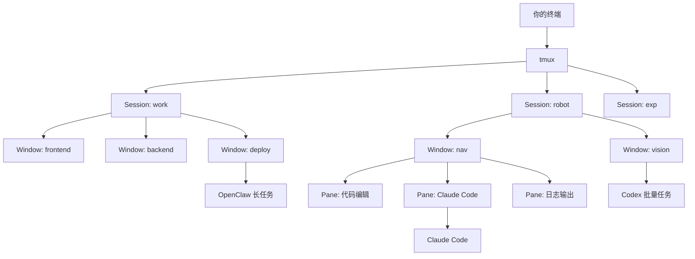
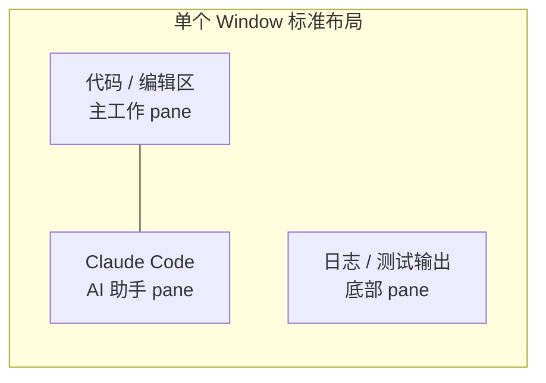

# tmux × AI — 用 tmux 高效管理 Claude Code、Codex、OpenClaw

> 一份开源工作流指南，帮助你用 tmux 同时驾驭多个 AI 编程工具，让 AI 在后台持续工作，你专注于真正重要的事。

[](LICENSE)
[](CONTRIBUTING.md)

---

## 为什么需要这份指南？

当你同时使用 Claude Code、Codex、OpenClaw 等 AI 工具时，你会遇到：

- 多个终端窗口散落一桌，不知道哪个在跑什么
- AI 任务在后台运行，但你切走了就找不回来
- 重启电脑后所有上下文全部丢失
- 不同项目的 AI 对话混在一起

**tmux 是解决这一切的基础设施。**

---

## 架构总览





**三层结构，一句话记住：**
> **Session** = 工作台　**Window** = 项目　**Pane** = 角色

---

## 快速开始

### 安装

```bash
# 一键安装（macOS / Linux）
bash <(curl -fsSL https://raw.githubusercontent.com/asimfish/tmux/main/install.sh)
```

或手动安装：

```bash
# 1. 安装 tmux
brew install tmux          # macOS
sudo apt install tmux      # Ubuntu

# 2. 克隆本仓库
git clone https://github.com/asimfish/tmux.git ~/tmux-ai

# 3. 应用配置
cp ~/tmux-ai/.tmux.conf ~/.tmux.conf

# 4. 安装插件管理器
git clone https://github.com/tmux-plugins/tpm ~/.tmux/plugins/tpm

# 5. 启动 tmux，安装插件
tmux
# 然后按 Ctrl-w + I（大写 i）
```

> 前缀键为 `Ctrl-w`，本文档快捷键均以此为准。

---

## 五分钟上手：第一个 AI 工作区

```bash
# 1. 新建项目 session
tmux new -s myproject

# 2. 左右分栏
Ctrl-w |

# 3. 右侧启动 Claude Code
Ctrl-w l
claude

# 4. 切回左侧，继续写代码
Ctrl-w h

# 5. 底部再加一个日志 pane
Ctrl-w -
```

现在你有了：左边写代码，右边 Claude 随时响应，底部看日志。

---

## 详细文档

| 文档 | 内容 |
|------|------|
| [架构详解](docs/architecture.md) | 三层结构图解、布局模板、设计原则 |
| [Claude Code 工作流](docs/claude-code.md) | 多项目并行、后台任务、复制粘贴技巧 |
| [Codex 工作流](docs/codex.md) | 批量任务调度、进度监控、结果汇总 |
| [OpenClaw 工作流](docs/openclaw.md) | 长任务管理、日志追踪、断线恢复 |
| [快捷键手册](docs/keybindings.md) | 完整快捷键速查表 |
| [进阶技巧](docs/tips.md) | 脚本自动化、命名规范、快照恢复 |

---

## 核心快捷键（30 秒速记）

```
会话管理
  Ctrl-w s          选择 session
  Ctrl-w d          退出 tmux（后台保持运行）
  Ctrl-w $          重命名 session

窗口管理
  Ctrl-w c          新建 window
  Ctrl-w w          选择 window
  Ctrl-w ,          重命名 window

面板操作
  Ctrl-w |          左右分栏
  Ctrl-w -          上下分栏
  Ctrl-w h/j/k/l    切换 pane
  Ctrl-w z          放大 / 还原 pane

保存恢复
  Ctrl-w Ctrl-s     保存工作环境快照
  Ctrl-w Ctrl-r     恢复工作环境
```

---

## 贡献

欢迎提交 PR，分享你的 AI 工作流配置和使用技巧！详见 [CONTRIBUTING.md](CONTRIBUTING.md)。

---

## License

[MIT](LICENSE)
