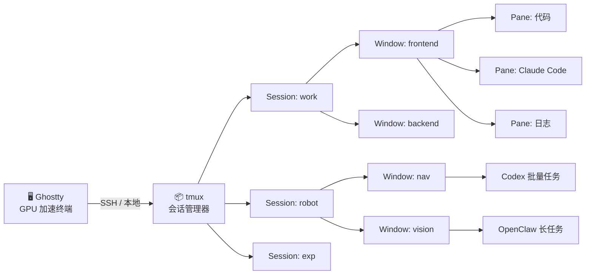

# tmux × AI — 用 tmux 高效管理 Claude Code、Codex、OpenClaw

> 一份开源工作流指南，帮你从零搭建 **Ghostty + tmux + AI 工具** 的完整终端工作流，让多个 AI 在后台并行工作，你专注于真正重要的事。

[](LICENSE)
[](CONTRIBUTING.md)

---

## 一键部署

```bash
git clone https://github.com/asimfish/tmux.git ~/tmux-ai
bash ~/tmux-ai/install.sh
```

安装内容：Ghostty 终端、tmux + 插件、starship / fzf / zoxide / eza / bat / lazygit 等配套工具，以及本仓库的 `.tmux.conf` 配置。

### 配置你的服务器（可选但推荐）

```bash
cd ~/tmux-ai
cp servers.conf.example servers.conf
```

编辑 `servers.conf`，每行一台服务器：

```
# 格式：别名  SSH地址  远程工作目录  密码(无则填-)  描述
liyufeng_4090    gpu-4090       ~/projects       -                  4090训练服务器
liyufeng_a100    gpu-a100       ~/experiments    -                  A100实验服务器
cloud_gpu        cloud-host     ~/               myP@ssw0rd123      云GPU（密码登录）
```

- **密码字段**填 `-` 表示公钥登录（推荐），填实际密码则自动通过 `sshpass` 免输入登录
- `servers.conf` 已加入 `.gitignore`，不会被提交到仓库
- 安装脚本会自动 `chmod 600 servers.conf` 限制权限

**SSH 配置**：在 `~/.ssh/config` 中配置 Host 别名（`servers.conf` 中的 SSH 地址对应这里的 Host）：

```
Host gpu-4090
    HostName 192.168.1.100
    User liyufeng
    Port 22
    ControlMaster auto
    ControlPath ~/.ssh/sockets/%r@%h-%p
    ControlPersist 600
```

```bash
mkdir -p ~/.ssh/sockets
```

**公钥登录**（推荐）：

```bash
ssh-keygen -t ed25519                 # 生成密钥（已有则跳过）
ssh-copy-id user@服务器IP              # 发公钥到服务器
```

配置完成后，下面所有功能都能用了。

加 alias 到 `~/.zshrc` 简化调用（`install.sh` 会自动添加）：

```bash
alias slogin="bash ~/tmux-ai/scripts/login.sh"
alias smon="bash ~/tmux-ai/scripts/server-monitor.sh"
alias sexec="bash ~/tmux-ai/scripts/server-exec.sh"
alias gpum="bash ~/tmux-ai/scripts/gpu-manager.sh"
alias bind-server="bash ~/tmux-ai/scripts/bind-server.sh"
alias supershell="bash ~/tmux-ai/scripts/supershell.sh"
alias setup-workspace="bash ~/tmux-ai/scripts/setup-workspace.sh"
alias health-check="bash ~/tmux-ai/scripts/health-check.sh"
alias wizard="bash ~/tmux-ai/scripts/wizard.sh"
```

---

## 完整工具链



**一句话记住三层结构：**
> **Session** = 工作台　**Window** = 项目　**Pane** = 角色

---

## 第一步：Ghostty 终端

Ghostty 是 GPU 加速的现代终端，macOS 上用 Metal 渲染，启动极快。

### 安装

```bash
brew install --cask ghostty
brew install --cask font-jetbrains-mono-nerd-font
```

### 核心快捷键

**Quick Terminal（最实用功能）**

```
Cmd+Shift+`     全局呼出 / 隐藏下拉终端（任意 App 均可触发）
```

> 从屏幕顶部滑出，按一下消失，再按一下恢复，状态保留。适合随时查看 AI 输出。

**标签页 & 窗口**

| 快捷键 | 功能 |
|--------|------|
| `Cmd+T` | 新建标签页 |
| `Cmd+W` | 关闭当前标签页 |
| `Cmd+数字` | 跳转第 N 个标签页 |
| `Cmd+Shift+[/]` | 上 / 下一个标签页 |
| `Cmd+N` | 新建窗口 |

**分屏**

| 快捷键 | 功能 |
|--------|------|
| `Cmd+D` | 右侧分屏 |
| `Cmd+Shift+D` | 下方分屏 |
| `Cmd+Shift+H/J/K/L` | 切换分屏（vim 风格）|
| `Cmd+Shift+Enter` | 当前分屏全屏 / 恢复 |
| `Ctrl+Shift+方向键` | 调整分屏大小 |

**实用功能**

| 快捷键 | 功能 |
|--------|------|
| `Cmd+K` | 清屏 |
| `Cmd+Shift+F` | 全文搜索 |
| `Cmd+Shift+↑/↓` | 跳到上 / 下一条命令（按命令块跳转）|
| `Cmd+Z` | 撤销关闭的 tab/split（30 秒内有效）|

### Ghostty vs tmux 分工

| 场景 | 用哪个 |
|------|--------|
| 本地日常分屏 / 多标签 | Ghostty 原生分屏 |
| 全局随时呼出终端 | Ghostty Quick Terminal |
| SSH 远程服务器后分屏 | tmux |
| 断线后保持 AI 进程运行 | tmux session |
| 管理多个 AI 项目工作区 | tmux（见下文）|

---

## 第二步：tmux 基础

### 安装 & 配置

```bash
# macOS
brew install tmux

# 应用本仓库配置
cp .tmux.conf ~/.tmux.conf

# 安装插件管理器 TPM
git clone https://github.com/tmux-plugins/tpm ~/.tmux/plugins/tpm

# 启动 tmux 后按 Ctrl-w + I 安装插件
tmux
```

> 本配置前缀键为 `Ctrl-w`，下文快捷键均以此为准。

### 核心快捷键

> 两套键位**同时有效**，任选其一。详见 [完整快捷键手册](docs/keybindings.md)。

**Session / Window**

| tmux 原生 | Ghostty 统一 | 功能 |
|-----------|-------------|------|
| `Ctrl-w s` | — | 选择 session |
| `Ctrl-w d` | — | 退出 tmux（session 保持后台运行）|
| `Ctrl-w c` | `Cmd+T` | 新建 window |
| `Ctrl-w x` | `Cmd+W` | 关闭当前 pane |
| `Ctrl-w n` | `Cmd+Shift+]` | 下一个 window |
| `Ctrl-w p` | `Cmd+Shift+[` | 上一个 window |
| `Ctrl-w ,` | — | 重命名 window |

**Pane 分栏**

| tmux 原生 | Ghostty 统一 | 功能 |
|-----------|-------------|------|
| `Ctrl-w \|` | `Cmd+D` | 左右分栏 |
| `Ctrl-w -` | `Cmd+Shift+D` | 上下分栏 |
| `Ctrl-w h/j/k/l` | `Cmd+Shift+H/J/K/L` | 切换 pane |
| `Ctrl-w z` | `Cmd+Shift+Enter` | 放大 / 还原当前 pane |
| `Ctrl-w =` | `Cmd+Shift+=` | 均分所有 pane |
| `Ctrl-w Ctrl-h/j/k/l` | `Ctrl+Shift+方向键` | 调整 pane 大小 |

**复制 & 粘贴**

| 操作 | 功能 |
|------|------|
| 鼠标拖选 | 自动复制到系统剪贴板，高亮保持（与 Ghostty 一致）|
| 右键 | 粘贴系统剪贴板 |
| `Ctrl-w [` → `v` → `y` | 键盘进入复制模式，选中，复制 |
| `Ctrl-w K` / `Cmd+K` | 清屏 + 清除历史 |
| `Ctrl-w r` | 重载配置文件 |

**快照恢复**

| tmux 原生 | 功能 |
|-----------|------|
| `Ctrl-w Ctrl-s` | 手动保存所有 session 布局 |
| `Ctrl-w Ctrl-r` | 恢复保存的布局 |

> `tmux-continuum` 每 15 分钟自动保存，开机自动恢复。

### 常用命令

```bash
tmux new -s robot          # 新建 session
tmux ls                    # 查看所有 session
tmux attach -t robot       # 进入 session
tmux kill-session -t robot # 删除 session
tmux kill-window -t robot:1 # 删除指定 window
```

---

## 第三步：服务器管理

> 配置一次，所有命令自动读取 `servers.conf`。

### 快速登录：`slogin`

SSH 到服务器并**自动进入远程 tmux**，关掉本机也不会中断服务器上的任务。

> 注意：不要用 `login` 作为 alias，它会和 macOS 系统命令 `/usr/bin/login` 冲突。

```bash
# 查看所有可用服务器
slogin --list

# 一键登录
slogin liyufeng_4090
```

登录逻辑：
1. SSH 连接到服务器
2. 如果远程已有同名 tmux session → 自动 attach（恢复之前的工作）
3. 如果没有 → 自动创建新 tmux session，cd 到配置的工作目录
4. 从服务器 detach（`Ctrl-w d`）后，所有进程继续运行
5. 下次 `slogin liyufeng_4090` 自动恢复

```bash
# 典型流程
slogin liyufeng_4090       # 登录，自动进 tmux
# ...在服务器上启动训练...
# Ctrl-w d                 # 退出，训练继续跑
# 第二天
slogin liyufeng_4090       # 自动 attach，查看训练进度
```

### 多服务器监控：`server-monitor`

类似 nvitop 的多服务器资源面板，实时显示 GPU、CPU、内存、磁盘和远程 tmux session。

```bash
# 持续刷新监控所有服务器（默认 10s 刷新）
smon

# 只查一次
smon --once

# 自定义刷新间隔
smon --interval 5

# 只监控指定服务器
smon liyufeng_4090
```

监控面板效果：

```
  ╔═══════════════════════════════════════════════════╗
  ║          🖥  多服务器监控面板  Server Monitor      ║
  ╚═══════════════════════════════════════════════════╝
  2026-03-25 10:30:00  |  3 台服务器  |  每 10s 刷新

━━━━━━━━━━━━━━━━━━━━━━━━━━━━━━━━━━━━━━━━━━━━━━━━━━━
  ● liyufeng_4090  gpu-4090  4090训练服务器
    up 15 days

    GPU
      [0] NVIDIA RTX 4090  使用率 ██████░░░░ 45%  显存 12.3/24.0G ████░░░ 51%  62°C
      [1] NVIDIA RTX 4090  使用率 ░░░░░░░░░░  0%  显存  0.5/24.0G ░░░░░░░  2%  35°C

    CPU  32 cores  load 4.5  ██████░░░░░░░░░░░░░░ 14%
    MEM  45.2G / 128.0G     ███████░░░░░░░░░░░░░ 35%
    DISK 850G / 2000G       ████████░░░░░░░░░░░░ 42%

    tmux sessions
      ▸ train: 2 windows (created Mon Mar 24 09:00:00 2026)
      ▸ debug: 1 windows (created Tue Mar 25 08:30:00 2026)
━━━━━━━━━━━━━━━━━━━━━━━━━━━━━━━━━━━━━━━━━━━━━━━━━━━
  ● liyufeng_a100  gpu-a100  A100实验服务器
  ...
```

> 所有服务器并行采集，不会因为一台离线卡住。离线服务器会显示红色状态。

### SuperShell：交互式会话管理器

> 类似截图中的 SuperShell，基于 fzf 的交互式面板，一站式管理所有 tmux session 和远程服务器。

```bash
# 命令行启动
supershell

# 在 tmux 中快捷键启动（弹窗模式）
Ctrl-w S
```

功能：
- **模糊搜索**：输入关键字快速定位 session 或服务器
- **实时预览**：右侧面板显示 session 内容 / 服务器状态
- **快捷操作**：新建 session、分屏、监控、挂载、刷新配置
- **一键登录**：选中远程服务器直接 SSH + tmux

更多 tmux 快捷键（`.tmux.conf` 中已配置）：

| 快捷键 | 功能 |
|--------|------|
| `Ctrl-w S` | 启动 SuperShell |
| `Ctrl-w M` | 启动监控面板（弹窗）|
| `Ctrl-w L` | 快速登录选择器 |

### 批量执行命令：`server-exec`

在多台服务器上同时执行命令，内置常用快捷指令。

```bash
# 所有服务器执行
sexec "nvidia-smi"

# 指定服务器
sexec -s pro13 "df -h ~"

# 交互模式
sexec -i

# 内置快捷命令
sexec gpu          # 所有服务器 GPU 状态
sexec tmux-ls      # 所有服务器 tmux sessions
sexec disk         # 磁盘使用
```

### GPU 进程管理：`gpu-manager`

跨服务器 GPU 进程管理，支持查看和远程 kill。

```bash
gpum              # fzf 交互式查看 + kill
gpum --list       # 列出所有 GPU 进程
gpum --free       # 查找空闲 GPU
gpum --kill pro13 12345  # 远程 kill 进程
```

### 配置向导：`wizard`

交互式添加/删除/测试服务器，以及 SSH 免密配置。

```bash
wizard             # 主菜单
wizard add         # 添加服务器
wizard test        # 测试所有连通性
wizard ssh-setup   # SSH 密钥配置
```

### 一键搭建工作区：`setup-workspace`

```bash
# 交互式选择模板
setup-workspace

# 直接指定模板
setup-workspace dev              # 标准开发布局
setup-workspace train liyufeng_4090  # 远程训练布局
setup-workspace multi            # 多服务器并行管理
setup-workspace claude           # Claude Code 专用
```

### 健康检查：`health-check`

```bash
health-check                    # 检查所有服务器
health-check liyufeng_4090      # 检查指定服务器
health-check --watch            # 持续监控，异常时 macOS 弹窗告警
health-check --json             # JSON 输出，供其他工具调用
```

检查项：GPU 温度、显存、内存使用率、磁盘空间、zombie 进程。超过阈值自动告警。

### bind-server：本地 Claude 管理远程服务器

> 用 sshfs 把服务器目录挂载到本地，Claude 直接读写远程文件，**无感知地在服务器上「开了一个 Claude」**。

**前置安装（macOS，只需一次）：**

```bash
brew install --cask macfuse          # 安装后重启 Mac，在「系统设置 → 隐私与安全」点允许
brew install gromgit/fuse/sshfs-mac
```

**使用：**

```bash
# 方式 1：从 servers.conf 读取（推荐）
bind-server liyufeng_4090

# 方式 2：直接指定
bind-server gpu-4090 ~/projects/train

# 批量挂载所有服务器
bind-server --all

# 查看挂载状态
bind-server --status

# 卸载
bind-server --unmount liyufeng_4090
bind-server --unmount-all
```

挂载后自动建立 tmux 布局：

```
┌──────────────────────┬───────────────────────┐
│                      │                       │
│   SSH 交互会话        │   本地 Claude Code    │
│   cd ~/projects/nav  │   工作目录 = 挂载目录  │
│   （你操作）          │   （AI 直接读写文件）  │
│                      │                       │
└──────────────────────┴───────────────────────┘
```

**核心规则：文件读写走挂载（代码/配置），命令执行走 SSH（训练/推理），大文件永不过本地。**

> 详细配置和原理见 [bind-server 详解](docs/bind-server.md) 和 [远程 SSH 工作流](docs/remote-ssh.md)。

---

## 第四步：AI 工具工作流

### 标准布局：一个项目三格分屏

```
┌─────────────────────┬──────────────────┐
│                     │                  │
│   代码编辑 / 终端    │   Claude Code    │
│      （主工作区）    │   claude>        │
│                     │                  │
├─────────────────────┴──────────────────┤
│              日志 / 测试 / Git 状态      │
└────────────────────────────────────────┘
```

搭建命令：

```bash
tmux new -s myproject
Ctrl-w |          # 左右分栏
Ctrl-w l          # 切右侧
claude            # 启动 Claude Code
Ctrl-w h          # 切左侧
Ctrl-w -          # 底部日志栏
```

### Claude Code：多项目并行

```bash
# 同一 session 内，每个模块一个 window
tmux new -s robot
Ctrl-w c → Ctrl-w , → 输入 "nav"      # 导航模块
Ctrl-w c → Ctrl-w , → 输入 "vision"   # 视觉模块
Ctrl-w c → Ctrl-w , → 输入 "arm"      # 机械臂模块

# 各 window 内分别启动 Claude
cd ~/robot/nav && claude
```

**让 Claude 后台跑，你去做别的：**

```bash
# 右侧 Claude pane 交代任务
claude> 帮我重构 src/controller.py，完成后告诉我

# 切到左侧继续写代码
Ctrl-w h

# 甚至完全退出 tmux，Claude 继续运行
Ctrl-w d

# 随时回来查看进度
tmux attach -t robot
```

### Codex：批量任务调度

```bash
# 新建专属 session
tmux new -s codex-batch

# 多个 window 并行跑不同任务
Ctrl-w c → Ctrl-w , → "refactor"
codex "重构 src/utils.py"

Ctrl-w c → Ctrl-w , → "tests"
codex "为所有 API 接口生成单元测试"

# 底部 pane 监控进度
Ctrl-w - → watch -n 3 git status
```

### OpenClaw：长任务监控

```bash
┌────────────────────────────────────────┐
│           OpenClaw 实时输出             │
├──────────────────┬─────────────────────┤
│   控制 / 干预    │   Claude 分析日志    │
└──────────────────┴─────────────────────┘
```

```bash
tmux new -s openclaw
# 上方全屏跑 OpenClaw
openclaw run task.yaml

# Ctrl-w - 分出底部，左右再分
# 左侧发控制指令，右侧开 Claude 分析日志
Ctrl-w -
Ctrl-w |
ctrl-w l → claude
```

### 多 Session 全局总览

```bash
# 按工作方向建 session，Ctrl-w s 弹出列表一键切换
tmux new -s work      # 主力工作
tmux new -s robot     # 机器人项目
tmux new -s exp       # 实验 / 原型
tmux new -s codex     # Codex 批量任务专用

# 查看所有 session
tmux ls

# 全局跳转
Ctrl-w s   # 弹出 session 列表，方向键选择 + Enter 确认
```

---

## 详细文档

| 文档 | 内容 |
|------|------|
| [服务器配置指南](docs/server-config.md) | servers.conf 格式、SSH 免密配置、多服务器管理 |
| [快速登录 & 监控](docs/server-tools.md) | slogin 一键登录、server-monitor 多服务器监控面板、健康检查 |
| [SuperShell & 工作区](docs/supershell.md) | 交互式会话管理器、工作区模板、tmux 快捷键 |
| [架构详解](docs/architecture.md) | 三层结构图解、布局模板、设计原则 |
| [Ghostty 终端配置](docs/ghostty.md) | GPU 加速终端、Quick Terminal、与 tmux 分工 |
| [Claude Code 工作流](docs/claude-code.md) | 多项目并行、后台任务、复制粘贴技巧 |
| [Codex 工作流](docs/codex.md) | 批量任务调度、进度监控、结果汇总 |
| [OpenClaw 工作流](docs/openclaw.md) | 长任务管理、日志追踪、断线恢复 |
| [远程 SSH 工作流](docs/remote-ssh.md) | sshfs 挂载远程目录，体验等同在服务器上直接开 Claude；bind-server 一键建立布局 |
| [bind-server 详解](docs/bind-server.md) | 原理剖析、完整安装、参数说明、多服务器并行、常见问题排查 |
| [快捷键手册](docs/keybindings.md) | tmux 原生 + Ghostty 统一键位完整对照表 |
| [进阶技巧](docs/tips.md) | 脚本自动化、命名规范、快照恢复 |

---

## 贡献

欢迎提交 PR，分享你的 AI 工作流配置和使用技巧！详见 [CONTRIBUTING.md](CONTRIBUTING.md)。

---

## License

[MIT](LICENSE)
