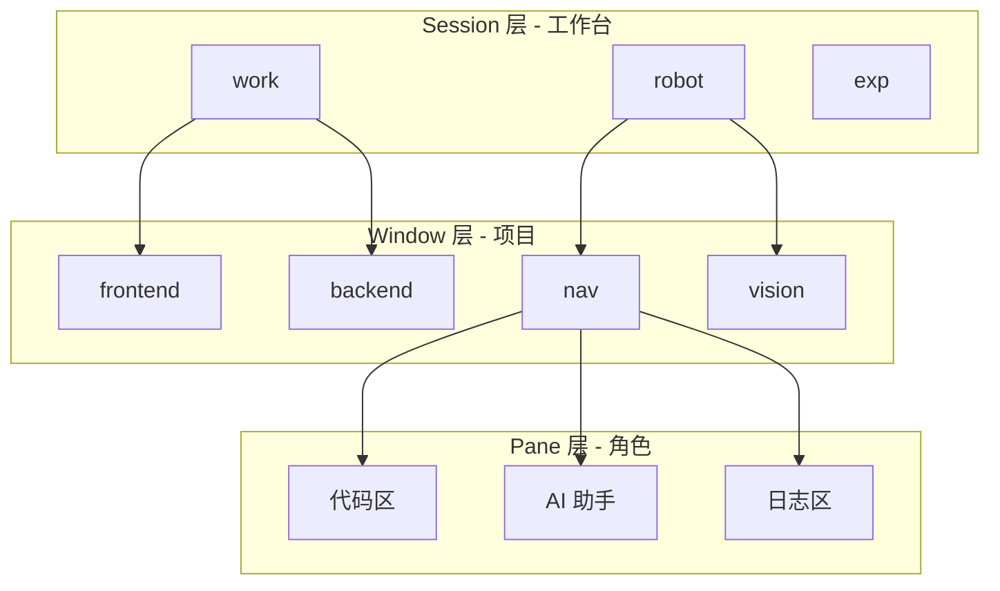
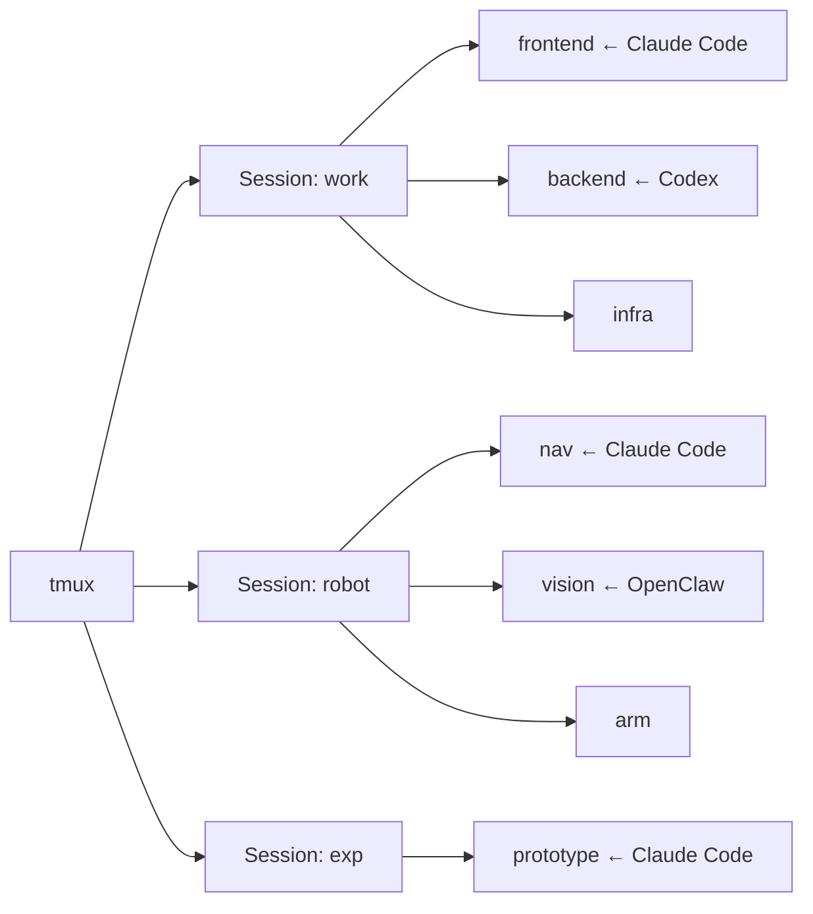

# 架构详解：tmux × AI 工具的三层结构

---

## 核心概念

tmux 提供三层组织结构，与 AI 多任务场景完美契合：



| 层级 | 类比 | AI 场景中的用途 |
|------|------|----------------|
| **Session** | 工作台 / 桌面 | 一类工作（工作项目、个人项目、实验）|
| **Window** | 项目文件夹 | 一个具体项目或模块 |
| **Pane** | 文件夹里的工具 | 代码编辑、AI 对话、日志输出各占一格 |

---

## 标准布局模板

### 模板一：单 AI 助手布局（日常推荐）

```
┌─────────────────────┬──────────────────┐
│                     │                  │
│   代码编辑 / 终端    │   Claude Code    │
│      （70%）        │     （30%）      │
│                     │                  │
├─────────────────────┴──────────────────┤
│           日志 / 测试 / Git 状态         │
│                  （25%）               │
└────────────────────────────────────────┘
```

搭建命令：
```bash
tmux new -s work
Ctrl-w |       # 左右分栏
Ctrl-w l       # 切右侧
claude         # 启动 Claude Code
Ctrl-w h       # 切左侧
Ctrl-w -       # 上下分栏
```

---

### 模板二：双 AI 对比布局（实验场景）

```
┌──────────────┬──────────────┬──────────────┐
│              │              │              │
│   代码编辑   │ Claude Code  │    Codex     │
│              │              │              │
└──────────────┴──────────────┴──────────────┘
│              日志 / 输出对比                │
└────────────────────────────────────────────┘
```

搭建命令：
```bash
tmux new -s compare
Ctrl-w |           # 左右分栏 → 左 / 右
Ctrl-w |           # 再分 → 左 / 中 / 右
Ctrl-w l           # 中间 pane
claude
Ctrl-w l           # 右侧 pane
codex              # 或 openai codex
# 底部日志
Ctrl-w h           # 回到左侧
Ctrl-w -
```

---

### 模板三：长任务监控布局（OpenClaw / 训练任务）

```
┌────────────────────────────────────────┐
│              OpenClaw 输出              │
│              （实时滚动）               │
├──────────────────┬─────────────────────┤
│   控制 / 干预    │    Claude 分析日志   │
│  （发送指令）    │   （解读输出含义）   │
└──────────────────┴─────────────────────┘
```

---

## 多项目全局视图



**按 `Ctrl-w s` 随时弹出全局 session 列表，一键跳转。**

---

## 设计原则

1. **一个 Window 只做一件事** — 不要在同一个 window 里混用多个不相关项目
2. **AI 工具独占一个 Pane** — 方便最大化查看（`Ctrl-w z`）
3. **日志 Pane 始终保留** — 放在底部，随时观察 AI 输出和程序运行状态
4. **Session 按生命周期命名** — `work`（长期）、`exp`（实验，用完即删）、`tmp`（临时）
5. **定期快照** — AI 任务跑到一半时 `Ctrl-w Ctrl-s`，防止意外丢失
