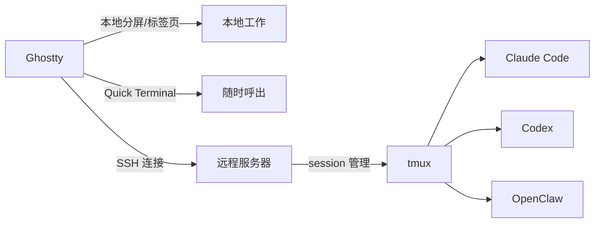

# Ghostty 终端配置与使用

> Ghostty 版本：1.3.1 | 配置文件：`~/.config/ghostty/config`

Ghostty 是用 Zig 编写的 GPU 加速终端模拟器，macOS 上使用 Metal 渲染。**与 tmux 配合使用是最佳实践**：Ghostty 管理本地标签页和下拉终端，tmux 管理远程服务器 session 和 AI 任务工作区。

---

## Ghostty × tmux 分工



| 场景 | 推荐工具 |
|------|----------|
| 本地分屏 / 多标签 | Ghostty 原生分屏 或 tmux（键位统一后无感）|
| 随时呼出终端 | Ghostty Quick Terminal |
| SSH 到服务器后分屏 | tmux |
| 断开 SSH 后保持 AI 进程 | tmux session |
| 管理多个 AI 项目工作区 | tmux（配合本指南工作流）|

---

## 键位统一：用 Ghostty 快捷键控制 tmux

通过在 Ghostty 配置里把 `Cmd` 系键位映射为发送 tmux 控制序列（`\x17` = `Ctrl-w`），可以让两套键位**同时有效**：

- **tmux 原生键位完全保留** — `Ctrl-w |`、`Ctrl-w -`、`Ctrl-w h/j/k/l` 照常工作
- **Ghostty 键位额外生效** — `Cmd+D` 等同样触发 tmux 指令

```ini
# ~/.config/ghostty/config

# 分屏：Cmd+D → tmux 左右分栏 (Ctrl-w |)
#       Cmd+Shift+D → tmux 上下分栏 (Ctrl-w -)
keybind = cmd+d=text:\x17|
keybind = cmd+shift+d=text:\x17-

# 切换 pane：Cmd+Shift+H/J/K/L → tmux pane 切换
keybind = cmd+shift+h=text:\x17h
keybind = cmd+shift+l=text:\x17l
keybind = cmd+shift+k=text:\x17k
keybind = cmd+shift+j=text:\x17j
```

生效后的完整对照表：

| 操作 | tmux 原生键位 | Ghostty 统一键位 |
|------|--------------|----------------|
| 左右分栏 | `Ctrl-w \|` | `Cmd+D` |
| 上下分栏 | `Ctrl-w -` | `Cmd+Shift+D` |
| 切左 pane | `Ctrl-w h` | `Cmd+Shift+H` |
| 切右 pane | `Ctrl-w l` | `Cmd+Shift+L` |
| 切上 pane | `Ctrl-w k` | `Cmd+Shift+K` |
| 切下 pane | `Ctrl-w j` | `Cmd+Shift+J` |
| 放大 / 还原 pane | `Ctrl-w z` | `Cmd+Shift+Enter` |
| 均分所有 pane | `Ctrl-w =` | `Cmd+Shift+=` |
| 新建 window | `Ctrl-w c` | `Cmd+T` |
| 关闭 pane | `Ctrl-w x` | `Cmd+W` |
| 上一个 window | `Ctrl-w p` | `Cmd+Shift+[` |
| 下一个 window | `Ctrl-w n` | `Cmd+Shift+]` |
| 调整 pane 大小 | `Ctrl-w ^h/^j/^k/^l` | `Ctrl+Shift+左/下/上/右` |
| 清屏 + 清历史 | `Ctrl-w K` | `Cmd+K` |

> 热重载配置：在 Ghostty 内按 `Cmd+,` 即可立即生效，无需重启。

> **原则**：所有 Ghostty 键位都是在 tmux 原生键位之上额外添加，两套完全并存，不互相覆盖。

---

## 安装

```bash
# 终端本体 + 字体
brew install --cask ghostty
brew install --cask font-jetbrains-mono-nerd-font

# 必装工具
brew install starship zsh-autosuggestions zsh-syntax-highlighting fzf zoxide eza bat

# 推荐安装
brew install ripgrep fd git-delta lazygit tldr btop
```

| 工具 | 用途 |
|------|------|
| `starship` | 美观的跨 shell 提示符 |
| `fzf` | 模糊搜索：历史命令、文件、目录 |
| `zoxide` | 智能目录跳转（替代 cd）|
| `eza` | 美化 ls，支持 tree |
| `bat` | 带语法高亮的 cat |
| `ripgrep` | 极快代码搜索（替代 grep）|
| `fd` | 极快文件搜索（替代 find）|
| `git-delta` | 美化 git diff，语法高亮 + side-by-side |
| `lazygit` | TUI git 客户端 |
| `btop` | 美观的系统资源监控 |

---

## 配置文件

| 文件 | 路径 |
|------|------|
| Ghostty 主配置 | `~/.config/ghostty/config` |
| Starship 提示符 | `~/.config/starship.toml` |
| Shell 配置 | `~/.zshrc` |

### 完整配置（`~/.config/ghostty/config`）

```ini
# ========== 主题 & 字体 ==========
theme = Catppuccin Mocha
font-family = JetBrainsMono Nerd Font
font-size = 14
font-feature = calt
font-feature = liga
adjust-cell-height = 25%

# ========== 透明度 & 窗口 ==========
background-opacity = 0.92
background-blur-radius = 20
window-padding-color = extend
window-inherit-working-directory = true
window-save-state = always

# ========== macOS 特性 ==========
macos-option-as-alt = true

# ========== Shell 集成 ==========
shell-integration = zsh
shell-integration-features = cursor,sudo,title

# ========== 其他 ==========
copy-on-select = clipboard
undo-timeout = 30s
bell-features = no-system,no-audio
scrollback-limit = 100000

# ========== Quick Terminal ==========
quick-terminal-position = top
quick-terminal-screen = main
quick-terminal-animation-duration = 0.15

# ========== 全局快捷键 ==========
keybind = global:cmd+backquote=toggle_quick_terminal
```

### git-delta 配置（追加到 `~/.gitconfig`）

```ini
[core]
    pager = delta
[interactive]
    diffFilter = delta --color-only
[delta]
    navigate = true
    side-by-side = true
    line-numbers = true
    syntax-theme = Catppuccin Mocha
[merge]
    conflictstyle = zdiff3
```

---

## 调试命令

```bash
ghostty +validate-config   # 验证配置语法
ghostty +show-config       # 查看当前生效配置
ghostty +list-keybinds     # 列出所有快捷键
ghostty +list-themes       # 列出所有内置主题
```

按 `Cmd+,` 可热重载配置（无需重启）。

---

## 快捷键速查

### Quick Terminal（最常用功能）

| 快捷键 | 功能 |
|--------|------|
| `Cmd+`` ` | 全局呼出 / 隐藏下拉终端（任意 App 均可触发）|

> Quick Terminal 是 Ghostty 最强特性：从屏幕顶部滑出，按一下消失，再按恢复，状态完全保留。配合 tmux，可以随时快速查看 AI 任务进度。

### 窗口 & 标签页

| 快捷键 | 功能 |
|--------|------|
| `Cmd+N` | 新建窗口 |
| `Cmd+T` | 新建标签页 |
| `Cmd+W` | 关闭当前标签页 / 分屏 |
| `Cmd+Shift+W` | 关闭整个窗口 |
| `Cmd+数字` | 跳转到第 N 个标签页 |
| `Cmd+Shift+[` | 上一个标签页 |
| `Cmd+Shift+]` | 下一个标签页 |

### 分屏

| 快捷键 | 功能 |
|--------|------|
| `Cmd+D` | 右侧分屏 / tmux 左右分栏（键位统一后）|
| `Cmd+Shift+D` | 下方分屏 / tmux 上下分栏（键位统一后）|
| `Cmd+Shift+H/J/K/L` | 跳转分屏 / tmux pane 切换（键位统一后）|
| `Ctrl+Shift+方向键` | 调整分屏大小 |
| `Cmd+Shift+Enter` | 当前分屏全屏 / 恢复 |
| `Cmd+Shift+=` | 所有分屏等分 |

### 滚动 & 导航

| 快捷键 | 功能 |
|--------|------|
| `Cmd+↑` | 滚动到顶部 |
| `Cmd+↓` | 滚动到底部 |
| `Cmd+Shift+↑` | 跳到上一条命令（按命令块跳转）|
| `Cmd+Shift+↓` | 跳到下一条命令 |

> `Cmd+Shift+↑/↓` 依赖 shell 集成，可在长输出中直接按命令块跳转，查看 AI 输出历史非常实用。

### 实用功能

| 快捷键 | 功能 |
|--------|------|
| `Cmd+K` | 清屏（清除 scrollback）|
| `Cmd+Shift+F` | 全文搜索 |
| `Cmd+Shift+P` | 命令面板（类似 VSCode）|
| `Cmd+Shift+O` | 在编辑器中打开完整 scrollback |
| `Cmd+Shift+T` | 窗口置顶 |
| `Cmd+Shift+\` | 切换透明 / 不透明 |
| `Cmd+=` / `Cmd+-` | 字体放大 / 缩小 |
| `Cmd+0` | 字体大小重置 |
| `Cmd+Z` | 撤销（30 秒内恢复刚关闭的 tab/split）|

---

## 配套工具使用

### fzf（模糊搜索）

| 快捷键 | 功能 |
|--------|------|
| `Ctrl+R` | 模糊搜索历史命令 |
| `Ctrl+T` | 模糊搜索当前目录文件（带 bat 预览）|
| `Alt+C` | 模糊搜索子目录并跳转（带 eza tree 预览）|

> 需要 `macos-option-as-alt = true` 才能让 Alt+C 正常工作。

### zsh 补全

| 操作 | 功能 |
|------|------|
| `Ctrl+Space` | 接受灰色自动补全建议 |
| `Tab` | 补全路径 / 命令（菜单选择）|
| `↑` / `↓` | 按已输入前缀搜索历史 |

### zoxide（智能跳转）

```bash
z proj     # 跳转到含 proj 的最近访问目录
z -        # 跳回上一个目录
zi         # 交互式选择目录（需要 fzf）
```

### eza（替代 ls）

```bash
ls         # 已 alias 为 eza --icons
ll         # eza -lah --icons（详细列表）
lt         # eza --tree --icons（树形展示）
```

---

## 主题推荐

```bash
ghostty +list-themes   # 列出所有主题
```

修改配置中 `theme =` 字段，按 `Cmd+,` 热重载即可预览。

| 主题 | 风格 |
|------|------|
| `Catppuccin Mocha` | 暖色调深色（推荐）|
| `Catppuccin Macchiato` | 略浅的 Catppuccin |
| `TokyoNight Storm` | 冷色调深色 |
| `Kanagawa Wave` | 日式水墨风 |
| `Rose Pine Moon` | 柔和暖紫 |
| `Nord` | 极地冷色 |
| `Dracula` | 经典紫色 |
| `Gruvbox Dark` | 复古暖色 |

> 主题名区分大小写和空格，必须与 `/Applications/Ghostty.app/Contents/Resources/ghostty/themes/` 下的文件名完全一致。

---

## 常见问题

### 配置报错

```bash
ghostty +validate-config
```

常见坑：
- 主题名需带空格和大写：`Catppuccin Mocha` 而非 `catppuccin-mocha`
- 用 `bell-features`（复数）不是 `bell-feature`
- 时间值需带单位：`30s` 而非 `30`
- 键名用 `enter` 而非 `return`

### Quick Terminal 没反应

确认配置中有：
```ini
keybind = global:cmd+backquote=toggle_quick_terminal
```
`global:` 前缀表示即使 Ghostty 不在前台也能触发。

### fzf 的 Alt+C 不工作

确保配置了：
```ini
macos-option-as-alt = true
```

### 选中文字复制到哪

配置了 `copy-on-select = clipboard`，选中即复制到系统剪贴板，`Cmd+V` 直接粘贴。
